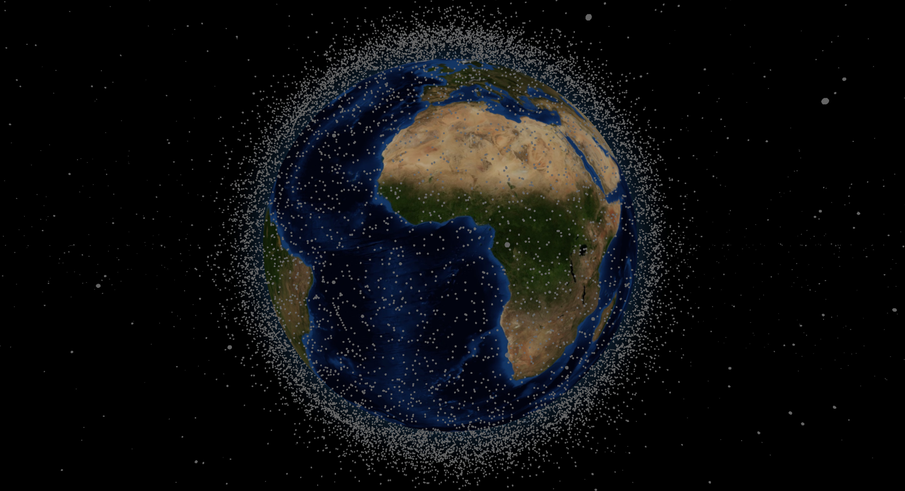

# Earth from Space

*NOTE: This project is an active work in progress.*

Interactive view of the Earth and orbiting satellites from your browser, inspired by Google Earth. Note that the performance varies greatly between different computers due to heavy GPU utilization.

Satellites (represented as grey dots) can be clicked on to get information about their name and movement.

## How to Run

The web app runs as a static web page, but it has to be built first from the source ES6 modules (by bundling with Webpack).

First install the NPM packages (via `npm i`). Then, the project can be automatically built and ran through the "dev" script (via `npm run dev`), or it can be built for production with the "build" script (via `npm run build`).
